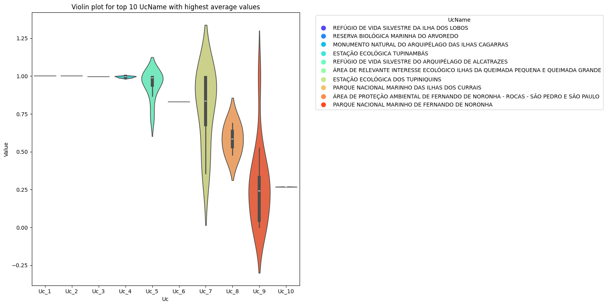

```python
import seaborn as sns
%matplotlib inline
```


```python
import matplotlib.pyplot as plt
```


```python
import pandas as pd
```


```python
adeq = pd.read_csv('results_extract.csv', encoding='latin1')
```


```python
adeq.head()
```


<table border="1" class="dataframe">
  <thead>
    <tr style="text-align: right;">
      <th></th>
      <th>UcName</th>
      <th>Value</th>
    </tr>
  </thead>
  <tbody>
    <tr>
      <th>0</th>
      <td>RESERVA BIOLÓGICA MARINHA DO ARVOREDO</td>
      <td>1.000</td>
    </tr>
    <tr>
      <th>1</th>
      <td>RESERVA BIOLÓGICA DO ATOL DAS ROCAS</td>
      <td>0.261</td>
    </tr>
    <tr>
      <th>2</th>
      <td>RESERVA BIOLÓGICA DO ATOL DAS ROCAS</td>
      <td>0.261</td>
    </tr>
    <tr>
      <th>3</th>
      <td>RESERVA BIOLÓGICA DO ATOL DAS ROCAS</td>
      <td>0.251</td>
    </tr>
    <tr>
      <th>4</th>
      <td>RESERVA BIOLÓGICA DO ATOL DAS ROCAS</td>
      <td>0.251</td>
    </tr>
  </tbody>
</table>
</div>


```python
# Calculate the average of 'Value' by 'UcName'
mean_values = adeq.groupby('UcName')['Value'].mean()
```


```python
# Select the 10 UcName with the highest averages
top_10_ucnames = mean_values.nlargest(10).index
```


```python
# Filter the DataFrame to include only these 10 UcNames
filtered_df = adeq[adeq['UcName'].isin(top_10_ucnames)].copy()
```


```python
# Sort the UcNames in the DataFrame based on the averages
filtered_df['UcName'] = pd.Categorical(filtered_df['UcName'], categories=top_10_ucnames, ordered=True)
filtered_df = filtered_df.sort_values('UcName')
```


```python
# Create a UcIndex column based on the order of averages
filtered_df['UcIndex'] = filtered_df['UcName'].cat.codes
```


```python
# Setting the figure and axis
plt.figure(figsize=(16, 8))  
ax = plt.gca()

# Plotting the data
sns.violinplot(x="UcIndex", y="Value", data=filtered_df, hue="UcIndex", palette='rainbow', legend=False, ax=ax)


# Adjusting the X-axis labels
ax.set_xticks(range(len(top_10_ucnames)))
ax.set_xticklabels([f'Uc_{i+1}' for i in range(len(top_10_ucnames))])

# Adjusting the X-axis limits to ensure alignment is correct
ax.set_xlim(-0.5, len(top_10_ucnames) - 0.5)

# Adjusting the layout
plt.xlabel('Uc')
plt.ylabel('Value')
plt.title('Violin plot for top 10 UcName with highest average values')

# Adding the legend next to the graph
handles = [plt.Line2D([0], [0], marker='o', color='w', label=top_10_ucnames[i], markersize=10, markerfacecolor=sns.color_palette('rainbow', n_colors=len(top_10_ucnames))[i]) for i in range(len(top_10_ucnames))]
plt.legend(handles=handles, title='UcName', bbox_to_anchor=(1.05, 1), loc='upper left')

plt.tight_layout()
plt.show()
```




